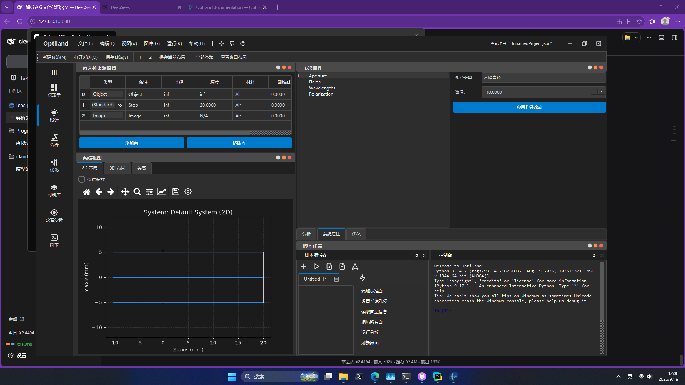

# optiland-zh

**Optiland GUI 简体中文汉化包** —— 运行期翻译层，不改上游源码一行。

[English](README.en.md) | 中文



> 这份 README 是**查阅手册**：怎么装、怎么用、怎么改。
> 想看这个项目的**来龙去脉和技术看点**（文字即逻辑键的陷阱、六个实测踩出来的坑、
> 覆盖率数字该怎么审查），读 [项目介绍](docs/intro.md)。

## 这是什么

[Optiland](https://github.com/optiland/optiland) 是一个功能完整的开源光学设计软件（序列/非序列光线追迹、优化、公差、MTF、Zemax 文件导入……），自带一个 Qt 图形界面。但它**只有英文，也没有任何多语言开关**——源码里 `self.tr()` 出现 0 次，没有 `.qm/.ts` 翻译文件，而且它还主动把语言钉死：

```python
QLocale.setDefault(QLocale(QLocale.Language.English, QLocale.Country.UnitedStates))
```

这个包把界面变成中文。**不修改 `site-packages`**，所以 `pip install -U optiland` 之后汉化依然有效。

## 安装

```sh
pip install "optiland[gui]"      # 先装 Optiland 本体
pip install optiland-gui-zh      # 再装汉化（发布后）
```

当前可以从源码装：

```sh
git clone <this-repo>
cd optiland-zh
pip install -e .
```

## 使用

```sh
optiland-zh
```

就这一条。它会装上汉化，然后拉起 Optiland GUI。

```sh
optiland-zh --list-languages    # 有哪些语言
optiland-zh --coverage          # 词库覆盖率报告
optiland-zh --self-test         # 离屏自检，不开窗口
optiland-zh -c my.json          # 用自定义词库调试
optiland-zh --no-locale         # 只换文字，不动 locale
```

也可以在自己的脚本里用：

```python
import optiland_zh

optiland_zh.install()                    # 必须早于 QApplication
from optiland_gui.run_gui import main
main()
```

## 为什么不直接改源码

改 `site-packages` 里的文件最简单，但 `pip install -U optiland` 一升级就全没了，而且没法作为独立项目分发。

所以这里的做法是：**在文字进入 Qt 之前把它换掉**。补丁打在 PySide6 的绑定类型上（PySide6 允许给它们赋值，这点已经实测确认）。

## 最难的部分：回译

汉化 Qt 应用有个隐藏陷阱，不注意就会把程序改坏。

Optiland GUI 里有 **18 处拿控件文字当逻辑键**用的代码：

```python
self.on_analysis_type_changed(self.analysisTypeCombo.currentText())
```

这一句是拿下拉框里**显示的文字**去查"分析类注册表"。如果把 `"Spot Diagram"` 翻成 `"点列图"`，`currentText()` 就返回 `"点列图"`，注册表查不到——**整个分析功能直接失效**。

`QLineEdit` 更危险，面型编辑就是这么写的：

```python
new_type = self.type_edit.text()                            # lens_editor.py:205
if new_type.lower().strip() in get_available_surface_types():
```

后面比的是**英文**面型表。只做单向翻译，`"标准" in ["standard", ...]` 是 `False`，面型修改会静默失效。

所以本项目的核心不是"替换字符串"，而是**双向**的：

| 方向 | 做法 |
|---|---|
| 文字**进入** Qt | 英译中（构造器 / `setText` / `addItem` / `addMenu` / …） |
| 原文**存起来** | 下拉框存进该项的 `userData`（自定义角色）；输入框存进 Qt 动态属性 |
| 逻辑**读出来** | `currentText()` / `QLineEdit.text()` 还原成英文 |
| 按文字**查找** | `findText()` / `setCurrentText()` 的查询词先中译英 |

界面是中文，程序内部看到的仍是英文，两边都不坏。

> `itemText()` **故意不回译**：Qt 拿它渲染下拉列表，回译了列表就变英文。
> 全库只有一处调用它，是喂给 `setCurrentText`，那条路径本来就是通的。

## 还拦了哪些"看不见"的地方

光拦 `QLabel` 是不够的，实测踩到过这些：

| 陷阱 | 后果 | 处理 |
|---|---|---|
| `QFormLayout.addRow("标签", 控件)` | 那个 QLabel 由 Qt 在 **C++ 内部**创建，Python 层看不到 | 补丁打在 `addRow` 上（一开始漏了 19 个标签） |
| `QDockWidget("标题", parent)` | 构造器不在白名单里就不翻 | 加入构造器清单 |
| Qt 自带的 OK / Cancel / 打开 / 保存 | 那些字是 Qt 内部产生的，Optiland 源码里根本没有 | 载入 `qtbase_zh_CN.qm`（PySide6 自带） |
| 优化器下拉项带前导空格做对齐 | `" Least Squares"` 精确匹配不上 `"Least Squares"` | 词库匹配容忍首尾空白，并保留原缩进 |
| `Toggle {0}` 这类模板 | `{0}` 里的 `"Analysis"` 不会自动翻，结果是「显示/隐藏 Analysis」 | 动态规则捕获到的内容再过一遍静态词条 |

## 词库

词库是**纯数据**，一种语言一个 JSON，放在 `src/optiland_zh/catalogs/`。

```json
{
  "language": "zh_CN",
  "entries": {
    "&File": "文件(&F)",
    "Lens Data Editor": "镜头数据编辑器"
  },
  "patterns": [
    { "match": "Field {0}: ({1}, {2})", "replace": "视场 {0}：({1}, {2})" }
  ]
}
```

动态消息用 `{0} {1}` 占位，运行期编译成正则——比让译者写 `(?P<n>.+?)` 友好得多。

### 加词条 / 加语言

1. 复制 `src/optiland_zh/catalogs/zh_CN.json`
2. 改 `language` / `display_name`
3. 翻译 `entries` 和 `patterns` 的 `replace`（**不要动 `match`**）
4. 跑 `optiland-zh -l <你的语言> --coverage` 看覆盖率

## 升级 Optiland 之后

上游加了新界面文字，词库就落后了。用提取器算差集：

```sh
python -m optiland_zh.extract --diff src/optiland_zh/catalogs/zh_CN.json
```

它会扫源码里的 AST，告诉你哪些新字符串还没翻，并按文件分组。提取器是**上下文感知**的，会自动排除：

- `setObjectName("AnalysisPanel")` 里的内部标识符
- 文档字符串（`"""..."""`）
- `print()` / `logger.debug()` 的控制台输出
- 样式表（QSS）、快捷键（`Ctrl+Q`）、配置键（`Layouts/Config`）
- 示例代码片段

不排除这些的话，第一次跑会得到 857 条候选，其中一大半是噪音；正确的过滤能压到 312 条，且都是真要翻的。

## 验证

```sh
optiland-zh --self-test     # 7 项断言：构造器/setText/菜单/下拉显示/回译/findText
optiland-zh --coverage      # 对源码的静态覆盖率
python -m optiland_zh.audit # 离屏建真实主窗口，遍历控件树逐条核对
```

`--audit` 是最硬的证据：它把所有面板都建出来（含未展开的菜单、未激活的标签页），
逐个文字节点和词库比对。当前结果：

```
窗口树里的文字节点: 1082
  已覆盖: 1047  (96.8%)
  未覆盖: 35

判定分档（强度从高到低）:
    974  exact-value           文字正好等于词库里的某条译文
     73  cjk-heuristic         含中文即算已汉化（宽松）
     35  MISS:not-translatable 本就是数字/objectName/第三方标识符

严格口径（只认 exact-value）: 974 / 1082 = 90.0%
真缺口（补丁没生效 + 仍是英文原文）: 0
```

**为什么要分档。** 单看"96.8% 已覆盖"没法判断里面有多少是靠宽松规则凑的。
`exact-value` 是硬证据；`cjk-heuristic`（含中文就算汉化）覆盖的是动态规则
拼出来的结果——它不会出现在词条值里，但也显然已经汉化。想逐条核查：

```sh
python -m optiland_zh.audit --rule cjk-heuristic
```

那 73 条实测全部属实：Qt 自动派生的 tooltip（`文件(&F)` → `文件(F)`）、
动态消息（`显示/隐藏 分析`、`视场 1：(0.000, 0.000)`）、带缩进的下拉项。

真正该盯的数字是 **`真缺口 = 0`**：没有任何一处"词库有译文却没生效"，
也没有任何一处"仍是英文原文"。剩下 35 条**本来就该是英文**：
Qt 的 objectName（`QuickActionsToolbar`）、scipy 算法名（`BFGS` / `SLSQP` /
`trust-constr`）、序号、品牌名 `Optiland`、装饰符 `|||`。

> 两个百分比别混：`--coverage` 是 **99.5%**，量的是"源码里的字符串翻了多少"；
> `--audit` 是 **96.8%**，量的是"界面上实际出现的文字有多少是中文"。
> 前者按源文件算，后者按运行时控件算——同一个字符串可能出现在几十个控件上，
> 反过来动态拼出来的字符串在源码里根本不存在，所以两个数不会相等。

> `--audit` 会临时关掉 VTK：离屏平台拿不到 OpenGL 像素格式，
> 3D 视图会让进程段错误（Windows 上 0xC0000005）。关掉后 GUI 走
> "VTK 不可用" 的降级分支，界面文字照样齐全。

## 已知限制

- **画在图里的文字够不到。** 绘图窗口标题（如 `System: Default System (2D)`）
  是 matplotlib 画的，不是 Qt 控件，本方案的补丁层碰不到。
  需要 matplotlib 自己的翻译机制，暂未处理。
- **只覆盖 Optiland 的界面。** 第三方控件（Jupyter 控制台的右键菜单等）
  能翻的部分靠 Qt 通用补丁顺带覆盖，剩余依赖它们自己的 i18n。
- **PySide6 版本差异。** 个别类在不同版本里位置不同（`QStandardItem` 在
  `QtGui` 而非 `QtWidgets`），引擎遇到找不到的类会跳过而不是崩，
  对应控件则不汉化。

## 本项目使用的术语

对齐 Zemax 中文版习惯：

| 英文 | 中文 |
|---|---|
| Lens Data Editor | 镜头数据编辑器 |
| Aperture / Field / Wavelength | 孔径 / 视场 / 波长 |
| Radius / Thickness / Material / Conic | 半径 / 厚度 / 材料 / 圆锥系数 |
| Stop / Sag / Semi-Diameter | 光阑 / 矢高 / 半口径 |
| Spot Diagram / Ray Fan | 点列图 / 光线扇形图 |
| OPD / MTF / PSF | 光程差 / 调制传递函数 / 点扩散函数 |

**故意不翻译**：`Cascadia Code`（字体名，翻了会换字体）、scipy 算法名、
Qt 的 objectName。

## 许可

MIT，见 [LICENSE](LICENSE)。

上游 [Optiland](https://github.com/optiland/optiland) 同为 MIT
（Copyright © 2024 Kramer Harrison）。本项目通过运行期补丁工作，不分发也不修改
其源码。第三方组件与术语来源的说明见 [NOTICE.md](NOTICE.md)。

## 贡献

见 [CONTRIBUTING.md](CONTRIBUTING.md)。最需要的贡献是**新语言**和**补词条**——
那两件事不需要懂 Python。
